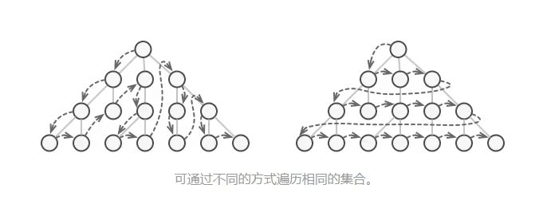

# [学习算法和刷题的框架思维](https://labuladong.github.io/algo/1/2/)
## 数据结构的存储方式
数据结构的存储方式只有两种：**数组(顺序存储)**和**链表(链式存储)**

## 数据结构的基本操作
对于任何数据结构，其基本操作无非遍历+访问，再具体一点就是：增删查改。
数据结构种类很多，但他们存在的目的都是**在不同的应用场景，尽可能高效地增删查改**。

- 数组遍历框架，典型的线性迭代结构:
    ```c++
        void traverse(int[] arr) {
            for (int i = 0; i < arr.length; i++) {
                // 迭代访问arr[i]
            } 
        } 
    ```
- 链表遍历框架，兼具迭代和递归结构
    ```c++
    /*基本的单链表节点*/
    class ListNode {
        int val;
        ListNode next;
    }
    
    void traverse(ListNode head) {
        for (ListNode p = head; p != null; p = p.next) {
            // 迭代访问 p.val
        }
    }
    
    void traverse(ListNode head) {
        // 递归访问 head.val
        traverse(head.next);
    }
    ```

- 二叉树遍历框架，典型的非线性递归遍历结构
    ```c++
    /*基本的二叉树节点*/
    class TreeNode {
        int val;
        TreeNode left, right;
    }
    
    void traverse(TreeNode root) {
        traverse(root.left);
        traverse(root.right);
    }
    ```

- N 叉树的遍历框架
    ```c++
    /*基本的N叉树节点*/
    class TreeNode {
        int val;
        TreeNode[] children;
    }
    
    void traverse(TreeNode root) {
        for(TreeNode child : root.children) {
            traverse(child);
        }
    }
    ```
## 二叉树两种遍历方式
- 递归
- 迭代



## 算法刷题指南

先刷二叉树，先刷二叉树，先刷二叉树
- 二叉树框架
    ```c++
    void traverse(TreeNode root) {
        // 前序遍历代码位置
        traverse(root.left);
        // 中序遍历代码位置
        traverse(root.right);
        // 后序遍历代码位置
    }
    ```

# [手把手带你刷二叉树（第二期）](https://labuladong.github.io/algo/2/18/23/)
- [654.最大二叉树](https://leetcode-cn.com/problems/maximum-binary-tree/)
- [105.从前序与中序遍历序列构造二叉树](https://leetcode-cn.com/problems/construct-binary-tree-from-preorder-and-inorder-traversal/)
- [106.从中序与后序遍历序列构造二叉树](https://leetcode-cn.com/problems/construct-binary-tree-from-inorder-and-postorder-traversal/)
- [889.根据前序和后序遍历构造二叉树](https://leetcode-cn.com/problems/construct-binary-tree-from-preorder-and-postorder-traversal/)


# [滑动窗口算法](https://labuladong.github.io/algo/2/21/60/)
- [76.最小覆盖子串](https://leetcode-cn.com/problems/minimum-window-substring/)
- [567.字符串的排列](https://leetcode-cn.com/problems/permutation-in-string/)
- [438.找到字符串中所有字母异位词](https://leetcode-cn.com/problems/find-all-anagrams-in-a-string/)
- [3.无重复字符串的最长子串](https://leetcode-cn.com/problems/longest-substring-without-repeating-characters/)

## c++ unordered_map 
- ```count(key)```: 相当于 Java 的 containsKey(key) 可以判断键 key 是否存在;
- ```map[key]```: 可以使用方括号访问键对应的值. 需要注意的是，如果该 key 不存在，C++ 会自动创建这个 key，并把 ```map[key]``` 赋值为 0。所以代码中多次出现的 ```map[key]++``` 相当于 Java 的 ```map.put(key, map.getOrDefault(key, 0) + 1)```